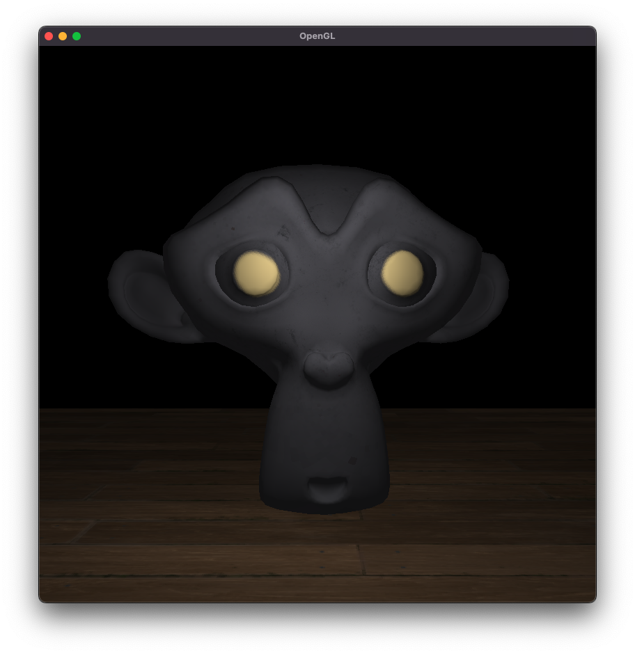

# Verus
Verus is an lightweight OpenGL rendering engine. It uses **glfw** for window management, **glad** for OpenGL function loading, and **glm** for mathematics and transformations. Features model loading, lighting (point, directional, and spot), and camera controls via mouse and keyboard inputs.

Currently, the project only supports loading `.gltf` models with support for diffuse and specular textures.

## Build Instructions
This project requires **cmake** and can be built and run as follows:

```sh
cmake . && make
./build/verus
```

## Camera
Use `W`/`A`/`S`/`D` to move forward/left/backward/right, `Space`/`Ctrl` to move up/down, and hold `Left Shift` for increased movement speed.

Left click and drag to look around. Mouse is hidden and locked to screen center while looking.

## Preview

