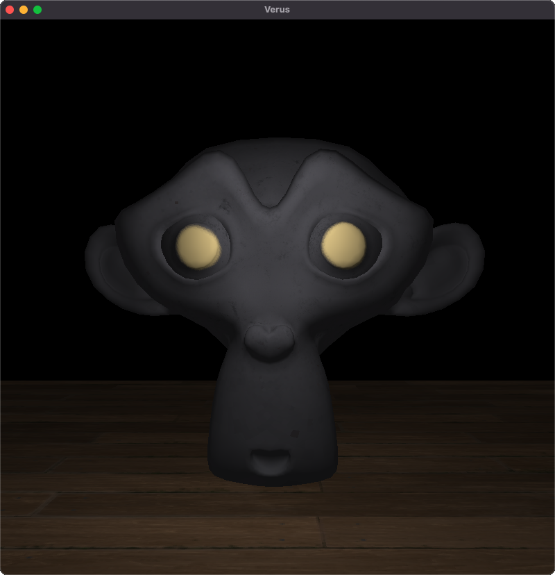

# VertExpr
An experimental OpenGL engine using `glfw` for window management, `glad` for OpenGL function loading, and `glm` for mathematics and transformations. Features model loading, lighting (point, directional, and spot), and camera controls via mouse and keyboard inputs.

## Build Instructions
This project requires `cmake` to build and can be built using the following command:

```sh
cmake . && make
```
Run the executable using `./build/opengl`.

## Project Structure
- `deps/` External header-only libraries and source dependencies
- `lib/` Pre-compiled library files (.so, .dll, .a)
- `src/` Project source files
- `include/` Project header files

## Loading Models
Currently, the project only supports loading `.gltf` models with support for diffuse and specular textures.

## Camera
Keyboard Controls:
  - `W`/`A`/`S`/`D` Move forward/left/backward/right
  - `Space`/`Ctrl` Move up/down
  - `Left Shift` Sprint (increased movement speed)

Mouse Controls:
  - Left click and drag to look around
  - Mouse is hidden and locked to screen center while looking

## Preview

